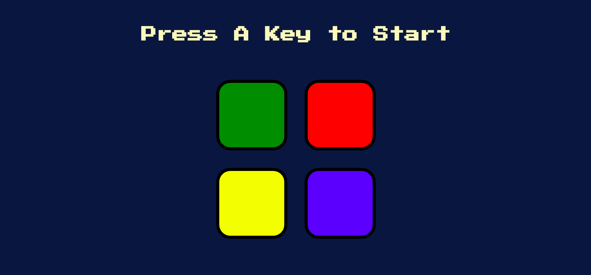

# Simon-Game
<!-- ALL-CONTRIBUTORS-BADGE:START - Do not remove or modify this section -->
[](#contributors-)
<!-- ALL-CONTRIBUTORS-BADGE:END -->


<!-- PROJECT LOGO -->
<br />
<p align="center">
  <h3 align="center">Simon Game</h3>
  <p align="center">
    A fun-way to flex your memorizing skills
    <br />
    <a href="https://github.com/Bauddhik-Geeks/Simon-Game/issues">Report Bug</a>
    ·
    <a href="https://github.com/Bauddhik-Geeks/Simon-Game/issues">Request Feature</a>
  </p>
</p>


<!-- ABOUT THE PROJECT -->
## About The Project



Want to test your memory in a fun-way?
Simon game is the right platform for you. You can check how much you can flex on your memory by playing this game. This is a very popular classic game, in which you have to memorize the pattern generated by computer and repeat the same pattern when it's your turn.


### Built With

* jQuery
* HTML
* CSS

<!-- GETTING STARTED -->
## Getting Started

To get a local copy up and running follow these simple steps.

### Installation

* Clone the repo
   ```sh
   git clone https://github.com/Bauddhik-Geeks/Simon-Game.git
   ```
* Open **_index.html_** in your favorite browser.

<!-- USAGE EXAMPLES -->
## Usage

You can easily start using the proect by doing following

- When the game is open in the browser of your choice. You can start playing by pressing any key.
- You have to follow the pattern that computer generates, and memorize it.
- When it is your turn you need to repeat the pattern to make a correct move.
- One wrong pattern and the game will be over.

<!-- CONTRIBUTING -->
## Contributing

Contributions are what make the open source community such an amazing place to learn, inspire, and create. Any contributions you make are **greatly appreciated**.

1. Fork the Project
2. Create your Feature Branch (`git checkout -b feature/AmazingFeature`)
3. Commit your Changes (`git commit -m 'Add some AmazingFeature'`)
4. Push to the Branch (`git push origin feature/AmazingFeature`)
5. Open a Pull Request

Project Link: [https://github.com/Bauddhik-Geeks/Simon-Game](https://github.com/Bauddhik-Geeks/Simon-Game)
## Contributors ✨

Thanks goes to these wonderful people ([emoji key](https://allcontributors.org/docs/en/emoji-key)):

<!-- ALL-CONTRIBUTORS-LIST:START - Do not remove or modify this section -->
<!-- prettier-ignore-start -->
<!-- markdownlint-disable -->
<table>
  <tr>
    <td align="center"><a href="https://linktr.ee/Vishal_D_A"><br /><sub><b>Vishal D A</b></sub></a><br /><a href="https://github.com/Bauddhik-Geeks/Simon-Game/commits?author=vishalda" title="Code">💻</a></td>
    <td align="center"><a href="https://avinash-tiwari.github.io/"><br /><sub><b>Avinash Tiwari</b></sub></a><br /><a href="https://github.com/Bauddhik-Geeks/Simon-Game/commits?author=avinash-tiwari" title="Code">💻</a></td>
  </tr>
</table>

<!-- markdownlint-restore -->
<!-- prettier-ignore-end -->

<!-- ALL-CONTRIBUTORS-LIST:END -->

This project follows the [all-contributors](https://github.com/all-contributors/all-contributors) specification. Contributions of any kind welcome!